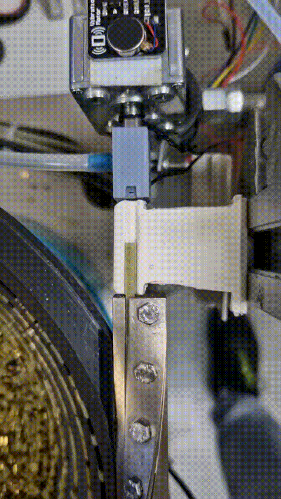

# Installation/Requirements:
- stm32cubeIDE: https://www.st.com/en/development-tools/stm32cubeide.html 
	+ The IDE is all in one (HAL-lib, compile, flash and hardware settings) and basicaly there is no need for other applications, BUT for terminal lovers following stuff is usefull! 
- STM32ProgramerCLI: https://www.st.com/en/development-tools/stm32cubeprog.html
- make
- arm-none-eabi-gcc
- arm-none-eabi-newlib
- disable fcyclomatic in STM32CubeIde
  + for anyone else like me, you need to click on the project name and only then go to File, Properties, C/C++ build, Miscellaneous)
  + https://community.st.com/t5/stm32cubeide-mcus/a-problem-with-fcyclomatic-complexity/m-p/633482#M23901
  
		
# Compile and Flash:
- ./st-compile-flash.sh

# Transmit via uart:
- ./st-transmit.sh

# Overview of prototype:

# Helpfull links:
- µC    : https://www.st.com/en/microcontrollers-microprocessors/stm32h7a3zi.html#documentation
- Board : https://www.st.com/en/evaluation-tools/nucleo-h7a3zi-q.html#overview
- misc  : https://os.mbed.com/platforms/ST-Nucleo-H7A3ZI-Q

# Wiring description of encodermotor:
- Red    - Motor power terminal (+)
- Black  - Quad encoder Ground
- Green  - Quad encoder B signal
- Blue   - Quad encoder +5Vcc
- Yellow - Quad encoder A signal
- White  - Motor power terminal (-)

# Notes:
- SWV from STM32CubeIde is configured and work fine, but only with X11
- SWV Data Trace Timeline Graph can plot in life time a content of chosen variable
- SWV ITM Data Console can output "printf()"

# TODO:
1. Create manual mode for motor control
2. Einstellmöglichkeit über -> conf.h
3. create uart transmit array

# Issues:
- it has been observed, that with system flash all pins are getting high, which causes the motor turn to a small degree
- contact issues with pogopins, apparently the suction causes MVS to jiggle from side to side
  + SOLVED with check valve!
